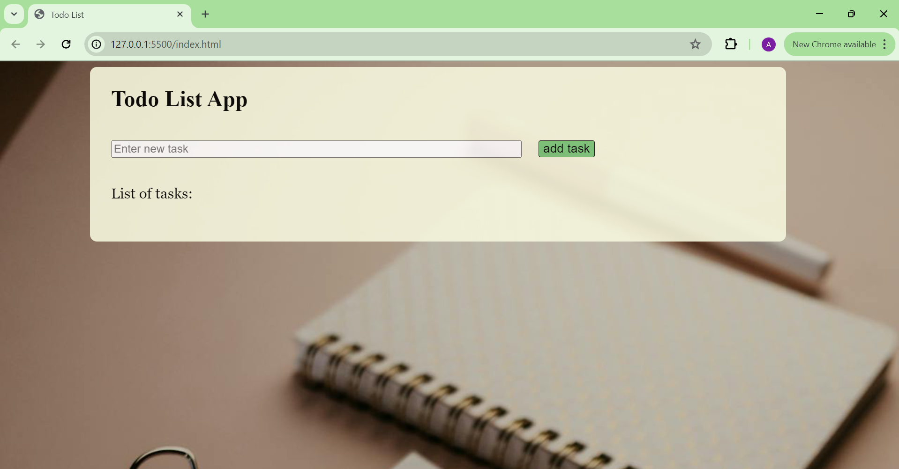
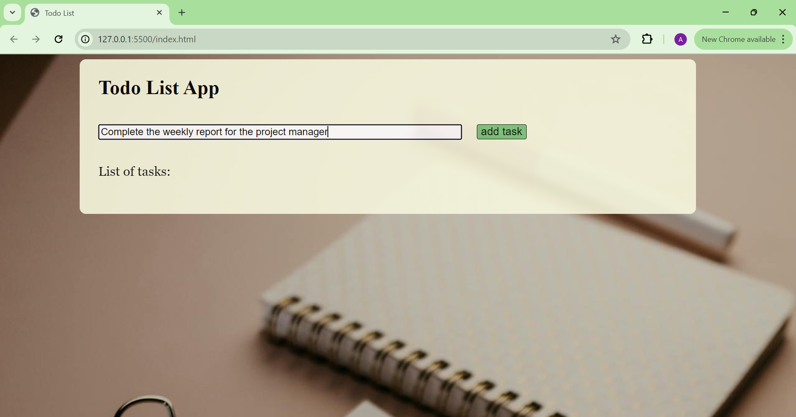
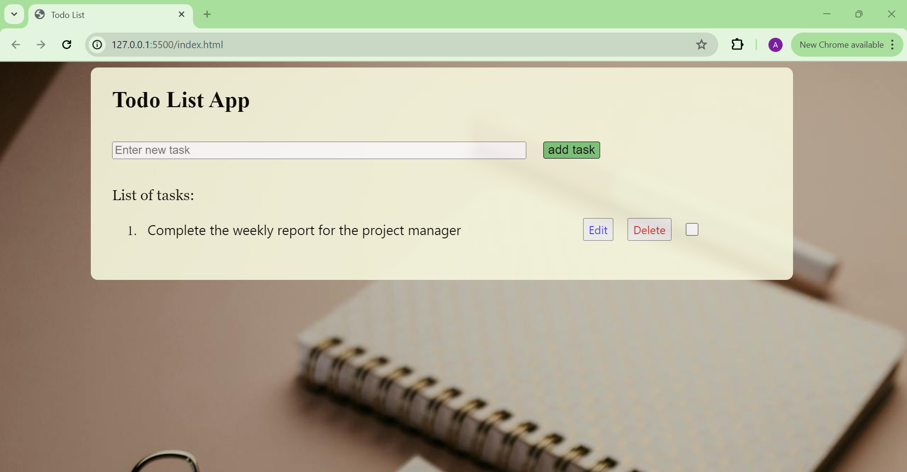
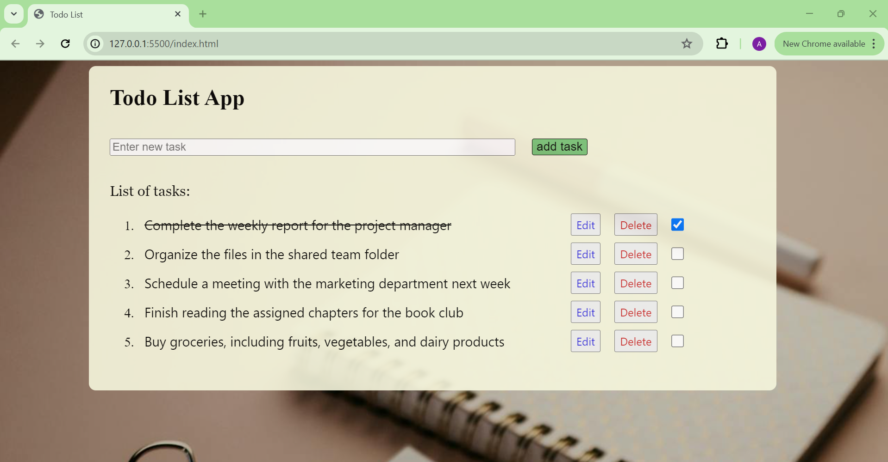
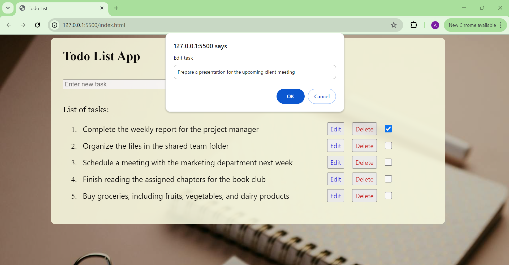

# Todo_app-typescript

## Introduction
This app is designed to help users manage their to-do lists.

## Features
- Add tasks
- Edit tasks
- Delete tasks
- Mark task as completed

When the page loads initially you should see the following page.


## Adding a task
To add a task just click on the input field and type in the task.


After that just click on 'add task' button. The task should be added and you should see the following page.


## Marking a task as done
To mark and unmark a task as done just click on the checkbox on the right.


## Editing a task
To edit a task click on the 'edit' button.
Then you will be prompted to add the new edited text.


After that click on the 'ok' button. The task should be edited with the new text and you should see the following page.


## Deleting a task
To delete a task click on the 'delete' button. The task should be deleted and you should see the following page.


## To run the app
Clone the repository by running the following command:
```bash
git clone https://github.com/AregawiF/Todo_app-typescript.git

and open the index.html file
